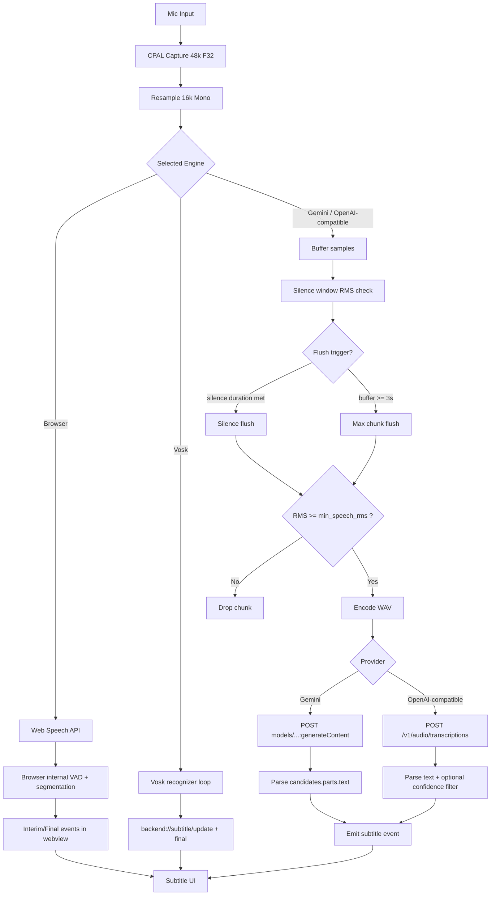

# STT + RMS Flow (Browser, Gemini, Vosk, OpenAI-Compatible)

เอกสารนี้อธิบายการทำงานของการจับเสียง, RMS gating, การตัด chunk และการส่ง STT สำหรับแต่ละ engine ในโปรเจกต์

## ภาพรวมแบบเร็ว

- จุดเริ่มต้นทุก engine คือ audio capture จากไมค์ผ่าน Rust
- เสียงถูก normalize เป็น 16kHz mono เพื่อให้ pipeline ฝั่ง STT ใช้รูปแบบเดียวกัน
- Browser และ Vosk มี behavior ต่างจาก Gemini/OpenAI-compatible ตรงที่การแบ่งคำพูดและการปล่อยผลลัพธ์
- Gemini/OpenAI-compatible ใช้ buffer + RMS/VAD gate ก่อนส่งขึ้น API

## Mermaid: End-to-End Flow

## พฤติกรรมแต่ละ Engine

### Browser

- Recognition รันใน webview ผ่าน Web Speech API
- Browser จัดการ segmentation/interim/final เอง
- เหมาะกับการเริ่มใช้งานเร็ว แต่ควบคุม low-level audio pipeline ได้น้อย

### Vosk

- On-device recognition ใน Rust
- ส่งผลผ่าน event backend://subtitle/update และ backend://subtitle/final
- เหมาะกับงานออฟไลน์และ latency คงที่

### Gemini (Batch)

- ใช้ Rust buffer/chunk แล้วส่ง WAV ไปที่ generateContent
- parse ข้อความจาก candidates.content.parts[].text
- ปัจจุบันเน้น final subtitle ต่อ chunk

### OpenAI-Compatible

- ใช้ Rust buffer/chunk แล้วส่ง multipart ไป /v1/audio/transcriptions
- อ่านผลจาก text/transcript ตาม response schema

## RMS + Chunking ที่ใช้อยู่ตอนนี้

- max chunk: 3 วินาที
- silence duration: 300ms
- Gemini default min_speech_rms: 0.006 (ไวขึ้นสำหรับไมค์ที่สัญญาณเบา)
- OpenAI-compatible default min_speech_rms: 0.04

หมายเหตุ: สามารถ override ค่า min_speech_rms ผ่าน Settings ใน UI ได้แล้ว โดยค่าจะถูก persist ลง settings store

## แนวทางจูนค่า

- ถ้าข้อความไม่ขึ้นเลย: ลด min_speech_rms
- ถ้ามีคำขยะหรือติดเสียงรบกวน: เพิ่ม min_speech_rms
- ถ้าต้องการจับประโยคยาวขึ้น: รักษา chunk ที่ ~3 วินาที และหลีกเลี่ยง silence flush ที่ถี่เกินไป

ช่วงค่าที่แนะนำสำหรับ Gemini

- ห้องเงียบ/เสียงเบา: 0.006 ถึง 0.010
- ทั่วไป: 0.010 ถึง 0.020
- มี noise มาก: 0.020 ขึ้นไป

## จุดสังเกตจาก Log สำหรับ Debug

- Remote ASR: max chunk reached ... rms=...
- Remote ASR: skipping ... below threshold ...
- send_gemini_batch_transcription: response status=...
- send_gemini_batch_transcription: extracted text ...

ถ้าเห็น max chunk แต่ตามด้วย skipping ตลอด แปลว่าต้องลด threshold หรือเพิ่ม gain ไมค์
